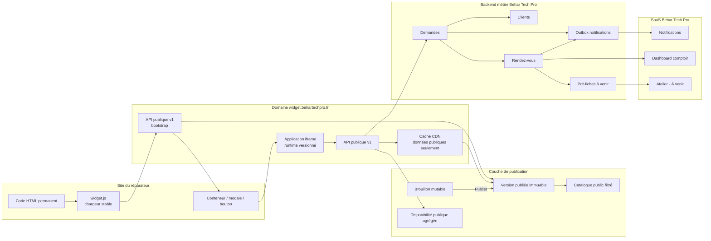
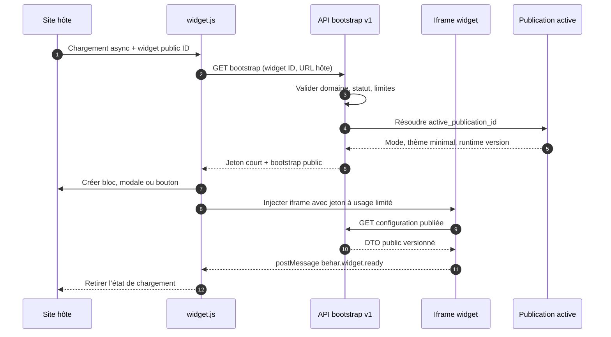
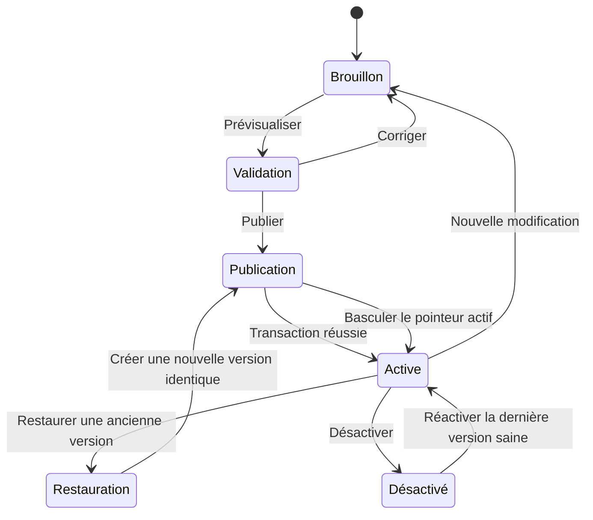
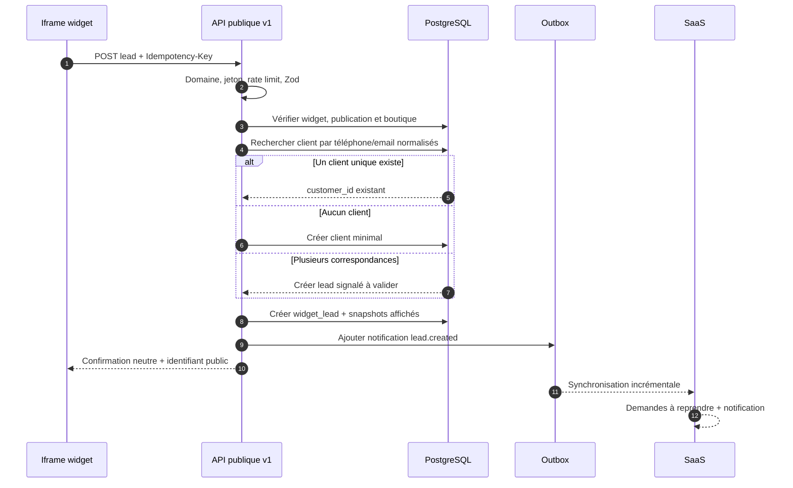
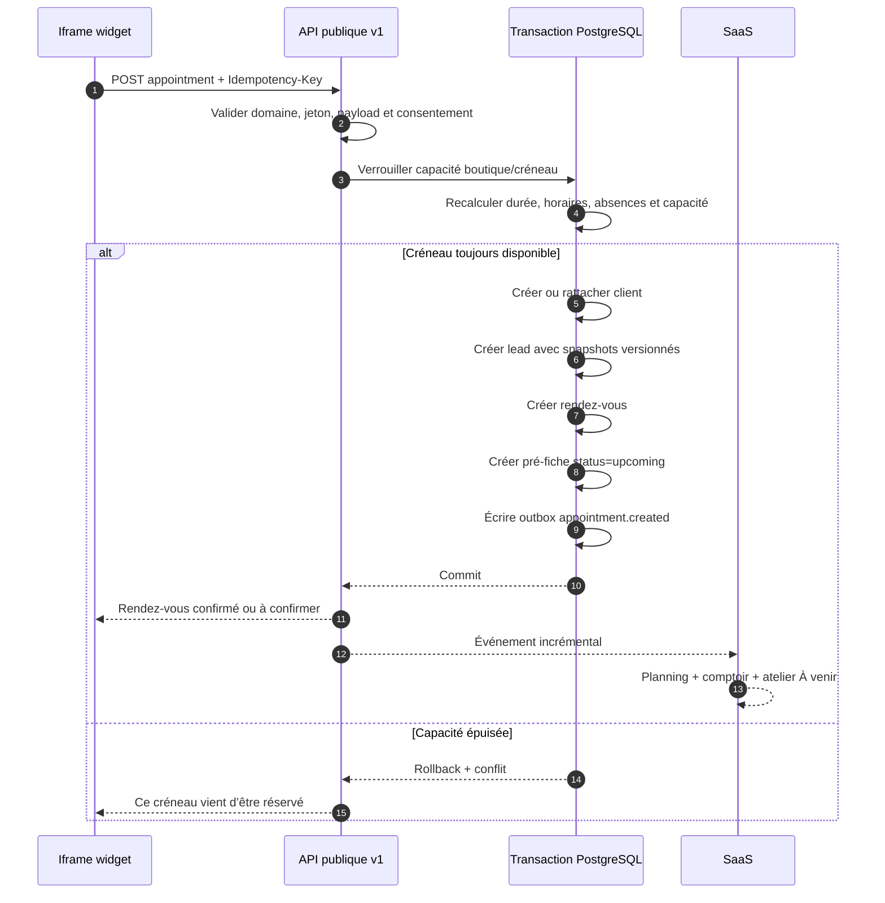

# Architecture technique — Widget client Behar Tech Pro

Version : 1.0  
Date : 10 juillet 2026  
Statut : décision d’architecture — aucune implémentation fonctionnelle  
Document source : `docs/audits/widget-client-technical-audit.md`

## 1. Décision d’architecture

Le widget sera distribué par un **chargeur JavaScript stable** qui crée une **iframe sécurisée** hébergée par Behar Tech Pro.

Code d’intégration permanent :

```html
<div id="repair-widget"></div>

<script
  src="https://widget.behartechpro.fr/widget.js"
  data-widget-id="IDENTIFIANT_PUBLIC"
  async>
</script>
```

Le réparateur ne remplace jamais ce code lorsqu’il modifie, publie ou restaure son widget. `IDENTIFIANT_PUBLIC` reste stable pendant toute la vie du widget. La configuration active est résolue côté serveur grâce à cet identifiant.

Le chargeur `widget.js` reste rétrocompatible et charge en interne une version immuable du runtime. Le HTML du site hôte ne dépend donc ni du numéro de publication du contenu, ni du hash des fichiers JavaScript, ni de la version courante de l’API.

## 2. Choix d’isolation

### Solution retenue : iframe sécurisée

| Critère | Iframe | Shadow DOM | Composant encapsulé |
|---|---:|---:|---:|
| Isolation du CSS hôte | Forte | Bonne mais incomplète | Faible |
| Isolation du JavaScript | Forte | Faible | Faible |
| CSP et origine séparée | Oui | Non | Non |
| Compatibilité WordPress/Shopify/Wix/Webflow | Forte | Variable | Variable |
| Protection contre les resets CSS agressifs | Forte | Partielle | Faible |
| Modale et bouton flottant | Oui | Oui | Oui |
| Accessibilité maîtrisable | Oui | Oui | Oui |
| Complexité opérationnelle | Moyenne | Moyenne | Faible |
| Adaptée aux coordonnées et réservations | Oui | Avec risques | Non recommandée |

L’iframe est retenue car le widget manipule des coordonnées personnelles et déclenche des écritures métier. Elle fournit une vraie frontière d’origine, empêche le CSS du site hôte d’altérer le parcours et empêche le CSS du widget de s’échapper vers le site.

### Rôle du chargeur JavaScript

Le chargeur ne contient aucune logique métier et ne reçoit aucune donnée personnelle. Il est limité à :

1. lire `data-widget-id` ;
2. détecter l’URL et le domaine hôtes ;
3. demander un jeton d’amorçage court au endpoint bootstrap ;
4. créer le conteneur ou le bouton correspondant au mode publié ;
5. injecter l’iframe ;
6. gérer ouverture, fermeture et redimensionnement via `postMessage` ;
7. afficher une erreur neutre si le widget est désactivé ou le domaine refusé.

Le chargeur ignore tout message provenant d’une origine autre que `https://widget.behartechpro.fr`. L’iframe n’accepte les messages que si `event.source === window.parent` et si leur schéma est valide.

### Attributs de l’iframe

Base recommandée :

```text
sandbox="allow-forms allow-scripts allow-same-origin"
referrerpolicy="strict-origin-when-cross-origin"
allow="camera 'none'; microphone 'none'; geolocation 'none'; payment 'none'"
```

L’autorisation photo, si elle arrive dans une version ultérieure, sera accordée explicitement et uniquement au flux concerné. L’iframe ne doit pas autoriser navigation du parent, popups ou téléchargement par défaut.

La réponse HTML de l’iframe ajoute une CSP dynamique avec `frame-ancestors` limité aux domaines publiés du widget. Cette règle complète, sans remplacer, la validation serveur du domaine.

## 3. Vue d’ensemble des composants



## 4. Responsabilités par couche

### Site du réparateur

- Héberge uniquement le snippet permanent.
- Ne détient ni secret, ni clé Supabase, ni configuration commerciale.
- Peut contenir plusieurs widgets si chaque script cible un conteneur distinct.
- Ne transmet pas les coordonnées du client en dehors de l’iframe.

### Script public `widget.js`

- Fichier très léger, sans dépendance et compatible avec les navigateurs modernes.
- Distribué avec `Cache-Control: public, max-age=300, stale-while-revalidate=86400`.
- URL stable ; son contenu peut charger un runtime interne hashé.
- Détecte les doubles initialisations pour éviter deux iframes.
- Ne plante jamais le site hôte : toutes ses erreurs sont capturées et isolées.
- Préserve la place du widget pendant le chargement pour limiter le déplacement visuel.

### Application iframe

- Héberge tout le parcours, ses styles, son état de session et son accessibilité.
- Charge uniquement une configuration publiée.
- N’accède jamais directement aux tables Supabase.
- Appelle exclusivement l’API publique versionnée.
- Sauvegarde seulement l’avancement non personnel dans `sessionStorage` avant consentement.

### API publique

- Résout l’identifiant public vers `workshop_id`, `shop_id` et publication active.
- Vérifie le domaine, le jeton bootstrap, les limites de débit et les schémas Zod.
- Construit des DTO publics par liste blanche.
- Ne renvoie jamais prix d’achat, marge, fournisseur, facture, lot ou référence interne.
- Effectue les créations métier dans des transactions idempotentes.

### Couche de publication

- Sépare le brouillon mutable des versions publiques immuables.
- Matérialise une projection publique du catalogue.
- Permet un cache CDN sans risque de servir un brouillon.
- Conserve l’historique, l’auteur, la date et la source de chaque version.

### Backend métier

- Dédoublonne ou crée le client.
- Crée une demande pour toute soumission exploitable.
- Crée le rendez-vous et la pré-fiche lorsque le parcours est une réservation.
- Écrit un événement d’outbox pour notifier le SaaS.
- Reste source de vérité pour les créneaux et la disponibilité réelle.

### SaaS existant

- Reçoit les nouveaux objets via une synchronisation incrémentale dédiée.
- Continue d’utiliser le store existant pour l’interface pendant la transition.
- Affiche la source `Widget site internet`, les alertes prix/stock et le statut.
- Ne transforme pas une pré-fiche en réparation active avant l’arrivée du client.

## 5. Trois modes d’affichage

Le mode est stocké dans la **configuration publiée**. Le snippet reste identique.

### Bloc intégré

- L’iframe est injectée dans `#repair-widget`.
- Largeur `100%`, hauteur initiale prudente puis ajustement contrôlé.
- Le message `behar.widget.resize` transmet une hauteur bornée.
- Le site hôte peut contraindre la largeur de son propre conteneur sans toucher au CSS interne.

### Fenêtre modale

- Le chargeur crée un bouton d’ouverture dans le conteneur.
- À l’ouverture, il affiche une couche isolée au-dessus de la page.
- Focus capturé dans la modale, fermeture par bouton et `Escape`, restauration du focus au déclencheur.
- Scroll du site hôte verrouillé uniquement pendant l’ouverture.
- Sur mobile, la modale devient une feuille plein écran.

### Bouton flottant

- Le chargeur ajoute un bouton accessible dans une zone fixe bornée.
- Position, libellé et couleur proviennent du bootstrap public.
- L’ouverture affiche la même modale sécurisée.
- Zones sûres configurables pour éviter les bandeaux cookies et outils d’assistance.

Le mode peut être changé et republié sans modifier le snippet. Une future option `data-display-mode` peut servir de surcharge d’intégration, mais elle n’est pas nécessaire au MVP et ne doit pas contourner une configuration interdite.

## 6. Chargement asynchrone et amorçage



Le jeton bootstrap est signé, expire rapidement et contient au minimum : identifiant public du widget, hash du domaine autorisé, publication active, version API, date d’expiration et nonce. Il n’autorise aucune opération interne.

## 7. API publique versionnée

Préfixe recommandé : `/api/public/v1/widgets/{widgetPublicId}`.

| Méthode | Route | Cache | Rôle |
|---|---|---|---|
| GET | `/bootstrap` | privé, très court | Domaine, mode et jeton iframe |
| GET | `/config` | CDN par version | Configuration publiée filtrée |
| GET | `/shops` | CDN par version | Boutiques publiques autorisées |
| GET | `/catalog/categories` | CDN par version | Catégories publiées |
| GET | `/catalog/brands` | CDN par version | Marques publiées |
| GET | `/catalog/models` | CDN par version | Modèles publiés |
| GET | `/catalog/issues` | CDN par version | Pannes/prestations publiées |
| POST | `/quote` | `no-store` | Résultat prix/stock/durée filtré |
| GET | `/slots` | très court ou `no-store` | Créneaux calculés par boutique |
| POST | `/leads` | `no-store` | Rappel ou demande de devis |
| POST | `/appointments` | `no-store` | Réservation transactionnelle |
| POST | `/events` | `no-store` | Analytics non personnels |
| POST | `/uploads/sign` | `no-store` | URL signée vers bucket privé |

Règles de version :

- la version majeure fait partie de l’URL ;
- les ajouts de champs restent rétrocompatibles dans `v1` ;
- les suppressions ou changements sémantiques nécessitent `v2` ;
- le runtime iframe déclare la version API qu’il comprend ;
- l’ancien runtime et l’ancienne API restent disponibles pendant une fenêtre de migration définie.

## 8. Cache sécurisé

Seules les données non personnelles et immuables peuvent être mises en cache publiquement.

### Cache autorisé

- runtime JavaScript/CSS hashé : un an, `immutable` ;
- version de publication : clé `{widgetPublicId}:{publicationVersion}` ;
- configuration, boutiques et catalogue public : CDN, ETag et `stale-while-revalidate` ;
- chargeur stable : cache court pour permettre un correctif rapide.

### Cache interdit ou très court

- bootstrap et jetons : `private, no-store` ;
- prix calculé selon un contexte : `no-store`, sauf résultat public strictement versionné ;
- stock et créneaux : `no-store` ou cache partagé inférieur à quelques secondes avec revalidation obligatoire ;
- demandes, rendez-vous, clients, consentements et uploads : `private, no-store`.

Toutes les clés de cache publiques incluent publication et boutique. Aucun cache ne dépend d’un `workshop_id` fourni par le navigateur.

## 9. Brouillon, publication et restauration



Modèle recommandé :

- `widget_settings` contient le brouillon courant et `active_publication_id` ;
- `widget_publications` contient des snapshots immuables numérotés ;
- `widget_public_catalog_entries` contient la projection commerciale liée à une publication ;
- publier crée une nouvelle version puis bascule atomiquement le pointeur actif ;
- restaurer ne remet pas le compteur en arrière : une nouvelle version est créée à partir de l’ancienne ;
- les sessions en cours restent sur leur version initiale jusqu’à la fin du parcours ;
- les nouvelles sessions utilisent immédiatement la version active.

Une publication échoue entièrement si une prestation publique est invalide, si le contraste est insuffisant, si une boutique n’a pas d’horaires ou si une règle tente d’exposer une donnée interdite.

## 10. Catalogue et stock publics

Le catalogue public est une **projection matérialisée par publication**, jamais une lecture directe de `PriceBookItem`.

Champs publics possibles : catégorie, marque, modèle, panne, prestation, qualité, type de prix, prix client, devise, délai, durée, garantie et identifiant public opaque.

Champs interdits : prix d’achat, marge, fournisseur, facture fournisseur, lot, coût moyen, emplacement, SKU interne, références internes et notes techniques.

Le stock public est calculé côté serveur :

```text
disponibilité vendable = quantité physique vendable
                       − quantité réservée
                       − quantité affectée à un dossier
```

Le résultat est ensuite réduit au niveau de publication : masqué, statut simple, délai ou quantité exacte. Le navigateur ne reçoit jamais les composantes internes du calcul.

## 11. Compatibilité multi-boutiques

Deux modes sont supportés :

- **widget mono-boutique** : `widget_settings.default_shop_id` fixe la boutique ;
- **widget multi-boutiques** : une liste ordonnée de boutiques publiées est proposée au client.

Chaque boutique possède ses horaires, capacité, catalogue publié, prix, stock, domaine métier et créneaux. Le choix de boutique est obligatoire avant toute demande de prix ou de disponibilité.

Le client transmet uniquement un identifiant public opaque de boutique. L’API le résout et vérifie qu’il appartient au widget et à l’atelier. Les objets créés reçoivent toujours `workshop_id` et `shop_id` depuis cette résolution serveur.

## 12. Création d’une demande



Une demande de rappel ou de devis ne crée pas une réparation active. Elle apparaît dans « Demandes à reprendre » et peut ensuite être convertie.

## 13. Création transactionnelle d’un rendez-vous



La contrainte d’idempotence est unique sur `{widget_id, idempotency_key, operation}`. Une répétition retourne la réponse initiale sans recréer le client, la demande ou le rendez-vous.

## 14. Notifications, comptoir et atelier

Les transactions métier écrivent des événements dans une table outbox. Un worker ou une fonction serveur les distribue vers :

- notification SaaS ;
- synchronisation incrémentale du store existant ;
- email réparateur si activé ;
- SMS ou notification mobile dans une version ultérieure.

L’outbox évite qu’un rendez-vous existe sans notification à cause d’une panne entre deux écritures.

Le comptoir affiche immédiatement : heure, client, téléphone, appareil, panne, badge Widget, prix et alerte stock. L’atelier reçoit une `pre_repair_case` dans « À venir ». La réparation active n’est créée qu’avec « Commencer la prise en charge ».

Pendant la transition local-first, un pont d’ingestion déduplique les objets serveur par identifiant stable et les fusionne dans le store. Le snapshot complet ne doit pas être le mécanisme de réception principal du widget, car deux écritures concurrentes pourraient s’écraser.

## 15. Domaines autorisés

La protection combine plusieurs mécanismes :

1. normalisation et publication explicite des domaines ;
2. vérification `Origin` et, à défaut, `Referer` lors du bootstrap ;
3. contrôle de `Sec-Fetch-Site` lorsque disponible ;
4. jeton bootstrap signé et lié au domaine ;
5. CSP `frame-ancestors` sur la page iframe ;
6. CORS limité aux origines publiées pour les endpoints appelés hors iframe ;
7. rate limiting et anti-abus indépendants du domaine.

Une origine web peut être imitée par un client non-navigateur. La liste de domaines protège donc l’intégration et le rendu, mais elle ne remplace jamais validation, limitation, CAPTCHA et idempotence.

Les environnements `localhost` et preview ne sont autorisés que dans des configurations de test explicites et jamais implicitement en production.

## 16. Validation côté serveur

Tous les endpoints utilisent des schémas stricts :

- longueurs maximales ;
- enums fermées ;
- téléphone et email normalisés ;
- date/heure avec fuseau de la boutique ;
- identifiants publics opaques ;
- rejet des champs inconnus pour les mutations ;
- contrôle de cohérence publication/boutique/service ;
- contrôle du consentement et de sa version ;
- validation MIME réelle et taille après décodage pour les fichiers.

Le serveur recalcule prix, stock, durée et créneau. Il ignore toute valeur commerciale envoyée par le navigateur. Les snapshots enregistrent exclusivement les valeurs calculées et affichées par le serveur.

## 17. Événements analytiques

Les événements sont envoyés en lots avec session anonyme et publication :

- `widget_loaded`, `widget_started` ;
- `category_selected`, `brand_selected`, `model_selected`, `issue_selected` ;
- `quote_requested`, `quote_displayed`, `quote_unavailable` ;
- `stock_displayed`, `stock_unknown` ;
- `contact_started`, `lead_submitted` ;
- `booking_started`, `slot_selected`, `appointment_created`, `appointment_failed` ;
- `widget_abandoned`.

Avant soumission, aucun événement ne contient nom, téléphone, email, commentaire ou photo. Après soumission, l’analytics conserve un lien technique vers le lead plutôt qu’une copie des coordonnées. Les IP, si nécessaires à l’anti-abus, sont pseudonymisées et soumises à rétention courte.

## 18. Contrats de messages `postMessage`

Messages iframe vers chargeur :

- `behar.widget.ready` ;
- `behar.widget.resize` avec hauteur bornée ;
- `behar.widget.opened` ;
- `behar.widget.close` ;
- `behar.widget.error` avec code public neutre.

Messages chargeur vers iframe :

- `behar.host.context` avec URL hôte sans fragment sensible ;
- `behar.host.open` ;
- `behar.host.close` ;
- `behar.host.visibility`.

Chaque message contient `protocolVersion`, `widgetPublicId` et nonce de session. Aucune coordonnée personnelle ne traverse `postMessage`.

## 19. Disponibilité et modes dégradés

- Échec du chargeur : aucun impact sur le site hôte.
- Bootstrap refusé : message neutre ou bouton masqué selon configuration.
- API catalogue indisponible : téléphone atelier et nouvelle tentative.
- Stock indisponible : « Disponibilité à confirmer », jamais « disponible » par défaut.
- Créneaux indisponibles : proposition de rappel.
- Échec de soumission : conservation locale temporaire du formulaire dans l’iframe, sans journal analytics contenant la PII.
- Circuit breaker possible sur les dépendances SMS/email ; la création métier reste prioritaire.

## 20. Structure logique des fichiers futurs

```text
public/
  widget.js                         # chargeur stable

src/app/(external)/embed/[widgetId]/
  page.tsx                          # application iframe

src/app/api/public/v1/widgets/[widgetId]/
  bootstrap/route.ts
  config/route.ts
  shops/route.ts
  catalog/.../route.ts
  quote/route.ts
  slots/route.ts
  leads/route.ts
  appointments/route.ts
  events/route.ts
  uploads/sign/route.ts

src/lib/widget/
  contracts.ts                      # types de protocole
  schemas.ts                        # validation Zod
  public-dtos.ts                    # listes blanches
  client.ts                         # client API iframe

src/lib/server/widget/
  resolve-widget.ts                 # tenant, boutique, publication
  domain-guard.ts
  catalog-service.ts
  availability-service.ts
  booking-service.ts
  lead-service.ts
  event-service.ts
  outbox-service.ts
```

Cette structure est indicative. Elle doit rester compatible avec les conventions Next App Router du dépôt et éviter d’ajouter les fonctionnalités du widget dans le déjà très volumineux `behar-store.ts` lorsque la logique appartient au serveur.

## 21. Invariants d’architecture

Les prompts d’implémentation devront préserver ces invariants :

1. le snippet public reste stable ;
2. aucune clé serveur n’entre dans le navigateur ;
3. aucune table contenant des PII n’est accessible directement à `anon` ;
4. seul le contenu publié peut être lu publiquement ;
5. les DTO publics sont construits par liste blanche ;
6. prix, stock et créneaux sont recalculés côté serveur ;
7. un rendez-vous est créé dans une transaction idempotente ;
8. chaque objet métier porte atelier et boutique résolus côté serveur ;
9. une pré-fiche n’est pas une réparation active ;
10. la restauration crée une nouvelle version auditable ;
11. l’iframe et le site hôte restent isolés ;
12. les erreurs publiques restent neutres et les détails restent dans les logs serveur.
